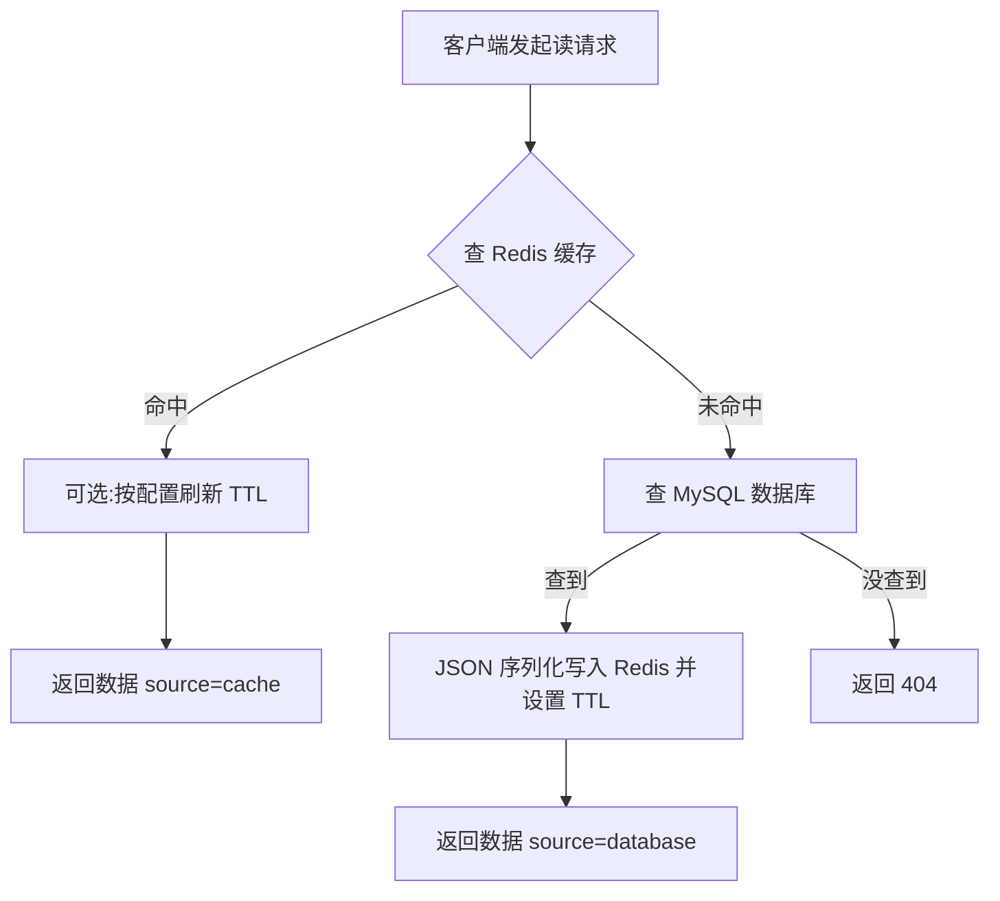
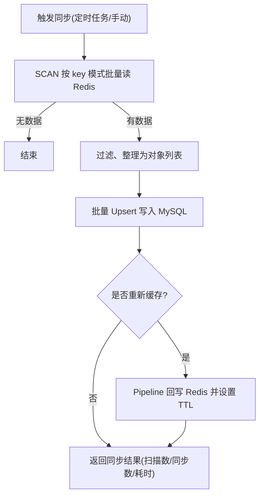
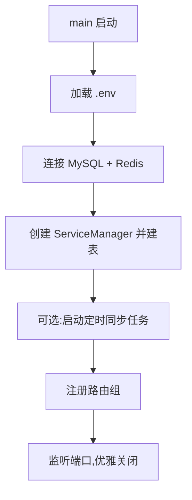

# AbstractManager

> 基于 Go 泛型的缓存管理框架:一套 `ServiceManager` 统一管理 **Redis 缓存 ↔ 关系型数据库** 的读写与同步,四个自动化路由组直接生成标准 RESTful API,无需手写路由处理函数。

[](https://github.com/Super-Gagaga/abstract-manager/actions/workflows/go.yml)
[](https://go.dev)
[](./LICENSE)

## 目录

- [特性](#特性)
- [架构设计](#架构设计)
- [快速开始](#快速开始)
- [核心组件](#核心组件)
- [HTTP API 参考](#http-api-参考)
- [过滤器系统](#过滤器系统)
- [Cache Aside 模式](#cache-aside-模式)
- [配置项一览](#配置项一览)
- [日志](#日志)
- [测试](#测试)
- [项目结构](#项目结构)
- [路线图](#路线图)
- [相关文档](#相关文档)
- [许可证](#许可证)

---

## 特性

- **泛型业务层 `ServiceManager[T]`**:一个类型参数同时覆盖 DDL、单条/批量数据库读写、缓存读写与缓存维护,自动从模型推导表名与缓存 key。
- **自动化 RESTful 路由**:四个路由组(`WriteRouterGroup` / `QueryRouterGroup` / `WritedownRouterGroup` / `LookupRouterGroup`)注册即得完整 API,只暴露需要的部分。
- **Cache Aside 一等公民**:单键查询自动走"先缓存、未命中回源 DB 并回填"流程,支持命中续期、TTL 环境变量统一配置。
- **统一过滤器系统**:同一份 JSON 过滤条件(`filters`)可同时翻译为 GORM 查询和 Redis 内存过滤,11 种操作符,两个后端语义一致。
- **缓存一致性工具箱**:乐观版本写入(WATCH/TxPipeline)、分布式锁防击穿、异步回填工作池、模式化失效、缓存预热与增量写入。
- **面向批量性能**:Redis Pipeline 批量读写、MGET 批量过滤、SCAN 游标遍历(生产安全替代 KEYS)、数据库批量 Upsert 与分批提交。
- **安全默认值**:SQL 标识符正则校验(防注入)、REPEATABLE READ 事务写入、可配置的 DB/Redis/DDL 分级超时。

---

## 架构设计

### 分层架构

示例与应用按四层组织,框架代码本身对应业务服务层与 HTTP 路由层:

```
┌─────────────────────────────────────┐
│   1. 环境初始化层 (initEnv)          │  加载 .env 配置
├─────────────────────────────────────┤
│   2. 基础设施层 (initInfra)          │  InitDB / InitRedis 连接池
├─────────────────────────────────────┤
│   3. 业务服务层 (ServiceManager)     │  泛型 CRUD + 缓存同步
├─────────────────────────────────────┤
│   4. HTTP 路由层 (http_router)       │  四个路由组 → RESTful API
└─────────────────────────────────────┘
```

### 数据流转

**Cache Aside 读数据**(单键查询 `GET /lookup/:key`):



**缓存 → 数据库批量同步**(示例中的定时任务):



**程序启动流程**:



---

## 快速开始

### 环境要求

- Go 1.24+
- MySQL(通过 GORM MySQL 驱动连接)
- Redis

### 安装

```bash
go get github.com/Super-Gagaga/abstract-manager
```

框架根目录没有 Go 文件,请按需导入子包:

```go
import (
    "github.com/Super-Gagaga/abstract-manager/http_router"
    "github.com/Super-Gagaga/abstract-manager/service"
)
```

> 国内网络环境可使用 `GOPROXY=https://goproxy.cn,direct` 加速下载。

### 配置环境变量

复制 [.env.example](./.env.example) 为 `.env` 并填入真实配置(完整变量清单见[配置项一览](#配置项一览)):

```env
# --- DB ---
DB_HOST=127.0.0.1
DB_PORT=3306
DB_USER=root
DB_PASSWORD=your_password
DB_NAME=your_database

# --- Redis ---
REDIS_HOST=127.0.0.1
REDIS_PORT=6379
# REDIS_PASSWORD=

# --- 服务 ---
PORT=8080

# --- Cache Aside ---
# 数据从 DB 加载并写入缓存后的 TTL(秒)
CACHE_ASIDE_TTL=3600
# 缓存命中时是否刷新 TTL
CACHE_HIT_REFRESH=false
```

### 运行示例

先确保 MySQL 与 Redis 已启动(示例启动时会连接并 AutoMigrate 建表:db_example 建 `products` 表,另两个示例建 `users` 表),然后:

```bash
# 示例一:数据库读写(WriteRouterGroup + QueryRouterGroup,含内置/自定义查询方法)
go run ./example/db_example

# 示例二:缓存读写 + 自定义业务过滤器
go run ./example/cache_example

# 示例三:Cache-Aside 数据一致性 + 定时缓存落库
go run ./example/dataConsistency_db_cache_example
```

服务默认监听 `http://localhost:8080`(`PORT` 可覆盖)。三个示例注册的路由:

| 示例 | 说明 |
|------|------|
| [db_example](./example/db_example/db_exp_main.go) | 数据库侧完整演示:`WriteRouterGroup`(单条/批量写入、Upsert、原子增减、软删除)+ `QueryRouterGroup`(内置 `list` / `active_list` / `search` 与自定义 `cheap` 查询方法、按 ID 查询、计数);启动时自动播种示例数据 |
| [cache_example](./example/cache_example/cache_exp_main.go) | 缓存侧完整四层分层演示;`WritedownRouterGroup` + `LookupRouterGroup`(含自定义 `activeUserFilter`) |
| [dataConsistency_db_cache_example](./example/dataConsistency_db_cache_example/ddce_main.go) | 在 cache_example 基础上增加 10 秒定时任务:Redis `user:*` 批量 Upsert 回 MySQL;含优雅关闭 |

---

## 核心组件

### ServiceManager

`service.NewServiceManager(model.User{})` 创建针对某个模型的业务管理器,自动推导表名、缓存 key 名。按类别的方法总览:

**DDL / 表管理**

| 方法 | 说明 |
|------|------|
| `Create` | AutoMigrate 建表,支持 `IfNotExists` / `DropIfExists` |
| `CreateWithIndexes` | 建表并创建二级索引(支持唯一索引) |
| `DropTable` / `HasTable` | 删表 / 判断表是否存在 |

**数据库单条写入(默认 REPEATABLE READ 事务)**

| 方法 | 说明 |
|------|------|
| `SetSingle` | 单条插入或 Upsert,可选写入后失效缓存 |
| `Update` / `UpdateByID` / `Save` | 更新指定行 / 按 ID 更新 / 整行保存 |
| `Upsert` | 指定冲突列与更新列的 Upsert |
| `Delete` / `DeleteByID` / `SoftDelete` / `SoftDeleteByID` | 硬删 / 软删(`deleted_at`) |
| `Increment` / `Decrement`(及 `*ByID`) | 原子自增 / 自减 |

**数据库批量写入**

| 方法 | 说明 |
|------|------|
| `SetQuery` | 批量插入 / Upsert(分批提交,默认 100/批),可选模式化失效缓存 |
| `BatchInsert` / `BatchUpsert` | 批量插入 / 批量 Upsert |
| `BatchUpdate` / `BatchDelete` / `BatchSoftDelete` | 按条件批量更新 / 删除 / 软删 |
| `BatchIncrement` / `BatchDecrement` | 批量原子增减(列名做注入校验) |

**数据库查询**

| 方法 | 说明 |
|------|------|
| `GetSingle` / `GetSingleByID` | 按条件 / 按 ID 查单条,支持 Preload、Select、ForUpdate |
| `GetSingleOrCreate` | 查询不到则创建 |
| `GetSingleWithLock` | `SELECT ... FOR UPDATE`,返回开放事务由调用方提交 |
| `GetFirst` / `GetLast` | 按 `created_at` 最早 / 最新一条 |
| `GetQuery` / `GetQueryWithoutTransaction` | 分页查询(总数、排序、分组、Having、Distinct、Preload) |
| `CountQuery` / `ExistsQuery` | 计数 / 存在性判断 |

**缓存读(Lookup)**

| 方法 | 说明 |
|------|------|
| `LookupSingle` | 读单个 key 并反序列化,未命中返回 `redis.Nil` |
| `LookupSingleWithFallback` | Cache-Aside 核心:命中返回,未命中查 DB 并异步回填 |
| `LookupSingleByID` | 按 ID 自动构建 `模型:id` 形式 key 后查询 |
| `LookupQuery` | MGET 批量查询,可选未命中回源 DB(从 key 解析 ID) |
| `LookupQueryByPattern` | SCAN 遍历模式匹配的 key 后批量查询 |
| `ExistsInCache` / `GetCacheTTL` / `ExtendCacheTTL` | 缓存存在性 / TTL 读取 / TTL 续期 |
| `InvalidateCache` / `InvalidateCacheByPattern` | 精确 / 模式化失效(SCAN + DEL) |
| `RefreshCache` | 批量从 DB 重查并回填缓存 |

**缓存写(Writedown)**

| 方法 | 说明 |
|------|------|
| `WritedownSingle` | JSON 序列化后写入,支持 `Overwrite` / `NX` / `XX` |
| `WritedownSingleAsync` | 异步写入(内置 4 worker 工作池,队列满时丢弃告警) |
| `WritedownSingleWithLock` | 以 `lock:<key>` SetNX 分布式锁防缓存击穿 |
| `WritedownSingleWithVersion` | WATCH/TxPipeline 乐观版本控制写入 |
| `WritedownQuery` / `WritedownWithPipeline` | 批量 Pipeline 写入,一次网络往返 |
| `WritedownIncremental` | 仅当数据变化时写入(比较函数判定) |
| `WritedownQueryFromDB` / `WritedownAllToCache` / `WarmupCache` | 从 DB 加载回填 / 全量重建 / 预热 |
| `ShutdownAsyncWorkers` | 优雅排空异步工作池 |

### HTTPRouterManager 与路由组

`http_router.NewHTTPRouterManager(svc)` 包装一个 ServiceManager;更常见的用法是直接使用四个路由组:

| 路由组 | 目标存储 | 职责 |
|--------|----------|------|
| `WriteRouterGroup` | MySQL | 单条/批量数据库写入 |
| `QueryRouterGroup` | MySQL | 方法化分页查询、按 ID 查询、计数 |
| `WritedownRouterGroup` | Redis | 单条/批量缓存写入、锁、版本、预热 |
| `LookupRouterGroup` | Redis(可回源 MySQL) | 模式查询、过滤器、Cache-Aside 单键查询、失效 |

示例(摘自 [ddce_main.go](./example/dataConsistency_db_cache_example/ddce_main.go)):

```go
group := r.Group("/api/v1/users")

// 缓存写入:POST /api/v1/users/cache/write 等
http_router.NewWritedownRouterGroup(group, userSvc).RegisterRoutes("/cache")

// 缓存查询:POST /api/v1/users/lookup/lookup、GET /api/v1/users/lookup/:key 等
lookupRg := http_router.NewLookupRouterGroup(group, userSvc)
lookupRg.SetDefaults("user:*", ttl)                 // 默认 key 模式与缓存时长
lookupRg.SetCacheAsideConfig(ttl, refreshOnHit)     // Cache-Aside TTL 与命中续期
lookupRg.SetCustomFilter(activeUserFilter)          // 可选:自定义业务过滤器
lookupRg.RegisterRoutes("/lookup")
```

---

## HTTP API 参考

### 统一响应格式

所有接口返回 `code`(0 成功,400 参数错误,500 服务错误)与 `message`,按接口类型附加数据字段:

```json
{
    "code": 0,
    "message": "success",
    "data": {},
    "keys": [],
    "count": 0,
    "items_written": 0,
    "rows_affected": 0
}
```

### 数据库写入 — WriteRouterGroup

`RegisterRoutes(basePath)` 注册以下端点(basePath 如 `/api/v1/users`):

| 方法 | 端点 | 说明 |
|------|------|------|
| POST | `{base}/set` | 单条插入 / Upsert(`on_conflict_update`、`invalidate_cache`) |
| POST | `{base}/insert` | 单条插入 |
| PUT | `{base}/update` | 按 `id` 更新字段 |
| DELETE | `{base}/delete` | 按 `id` 删除,`soft` 可选软删 |
| POST | `{base}/upsert` | 指定冲突列 / 更新列的 Upsert |
| POST | `{base}/increment` | 按 `id` 自增,`is_decr` 为自减 |
| POST | `{base}/batch/set` | 批量插入 / Upsert(`batch_size`) |
| POST | `{base}/batch/insert` | 批量插入 |
| PUT | `{base}/batch/update` | 批量更新 |
| DELETE | `{base}/batch/delete` | 按 `ids` 批量删除,`soft` 可选 |
| POST | `{base}/batch/upsert` | 批量 Upsert |
| POST | `{base}/batch/increment` | 批量自增 / 自减 |

请求示例(`POST {base}/batch/set`):

```json
{
    "data": [
        {"id": 1001, "username": "asdf", "email": "asdf@example.com"},
        {"id": 1002, "username": "fdsa", "email": "fdsa@example.com"}
    ],
    "batch_size": 100,
    "on_conflict_update": true,
    "invalidate_cache": false
}
```

### 数据库查询 — QueryRouterGroup

| 方法 | 端点 | 说明 |
|------|------|------|
| POST | `{base}/query` | 方法化分页查询(见下方) |
| GET | `{base}/:id` | 按 ID 查询单条,不存在返回 404 |
| POST | `{base}/count` | 按 `filters` 计数 |

`{base}/query` 采用"查询方法"机制:先通过 `RegisterMethod` / `RegisterCommonMethods` 注册命名方法(内置 `list`、`active_list`、`search`),请求时按名称调用:

```json
{
    "method": "list",
    "page": 1,
    "filters": [
        {"field": "age", "operator": ">=", "value": 21},
        {"field": "age", "operator": "<", "value": 24}
    ]
}
```

响应:

```json
{
    "code": 0,
    "message": "success",
    "data": [{"id": 1001, "username": "asdf", "age": 21}],
    "total": 1,
    "page": 1,
    "page_size": 20,
    "total_pages": 1
}
```

### 缓存写入 — WritedownRouterGroup

示例中 `RegisterRoutes("/cache")` 挂在 `/api/v1/users` 下,得到:

| 方法 | 端点 | 说明 |
|------|------|------|
| POST | `{base}/write` | 单条写入;`async: true` 走异步工作池 |
| POST | `{base}/write-lock` | 分布式锁保护下从 DB 加载并写入 |
| POST | `{base}/write-version` | 乐观版本号写入(版本不匹配则失败) |
| POST | `{base}/refresh` | 按 key / id 从 DB 刷新单个缓存 |
| POST | `{base}/batch-write` | 批量写入:`data` 直接给数据、`ids` 按 ID 从 DB 加载、`load_all` 全量 |
| POST | `{base}/warmup` | 缓存预热(按模板、数量、排序加载) |

TTL 优先级:请求中的 `expiration_seconds` > 环境变量 `CACHE_ASIDE_TTL` > 内置默认 3600 秒。

请求示例(`POST /api/v1/users/cache/batch-write`):

```json
{
    "key_template": "user:{id}",
    "data": [
        {"id": 1001, "username": "asdf", "email": "asdf@example.com"}
    ],
    "expiration_seconds": 1800,
    "batch_size": 100,
    "overwrite": true,
    "use_pipeline": true,
    "incremental": false
}
```

响应:

```json
{
    "code": 0,
    "message": "success",
    "items_written": 1
}
```

版本化写入示例(`POST /api/v1/users/cache/write-version`):

```json
{
    "key": "user:1006",
    "data": {"id": 1006, "username": "sukasuka", "email": "sukasuka@example.com", "age": 18},
    "version": 5,
    "expiration_seconds": 3600
}
```

### 缓存查询 — LookupRouterGroup

示例中 `RegisterRoutes("/lookup")` 挂在 `/api/v1/users` 下,得到:

| 方法 | 端点 | 说明 |
|------|------|------|
| POST | `{base}/lookup` | 按 `key_pattern` SCAN + MGET 批量查询,支持过滤器、自定义过滤器、回源 |
| GET | `{base}/:key` | 单键 Cache-Aside 查询(见 [Cache Aside 模式](#cache-aside-模式)) |
| POST | `{base}/count` | 统计匹配过滤条件的缓存键数量 |
| POST | `{base}/invalidate` | 按 `keys` 列表或 `pattern` 失效缓存 |

`POST {base}/lookup` 请求示例:

```json
{
    "key_pattern": "user:*",
    "filters": [
        {"field": "age", "operator": "between", "value": [21, 23]}
    ],
    "use_custom_filter": false,
    "fallback_db": false
}
```

响应:

```json
{
    "code": 0,
    "message": "success",
    "data": {
        "user:1001": {"id": 1001, "username": "asdf", "email": "asdf@example.com", "age": 21},
        "user:1002": {"id": 1002, "username": "fdsa", "email": "fdsa@example.com", "age": 22}
    },
    "keys": ["user:1001", "user:1002"],
    "count": 2
}
```

参数说明:

- `key_pattern`:Redis key 匹配模式,内部使用 SCAN 游标遍历
- `filters`:过滤条件数组,多条件为 AND 关系,支持全部 11 种操作符
- `use_custom_filter`:启用通过 `SetCustomFilter` 注入的自定义业务过滤器
- `fallback_db`:缓存无数据时是否回源数据库(携带 `filters` 时始终允许回源)

---

## 过滤器系统

### 翻译流水线

前端传入统一格式的 JSON 过滤条件,由翻译器注册表分别转换为 GORM 查询或 Redis 内存过滤:

```
前端 JSON(filters) → FilterParam → FilterTranslator → GormFilter / RedisFilter → 执行过滤
```

两个后端共享同一套操作符与语义,切换数据源无需改写过滤条件。

### 支持的操作符

| 操作符 | 含义 | 示例 |
|--------|------|------|
| `=` | 等于 | `{"field": "age", "operator": "=", "value": 25}` |
| `!=` | 不等于 | `{"field": "status", "operator": "!=", "value": "inactive"}` |
| `>` / `>=` | 大于 / 大于等于 | `{"field": "age", "operator": ">=", "value": 18}` |
| `<` / `<=` | 小于 / 小于等于 | `{"field": "price", "operator": "<=", "value": 100}` |
| `like` | 模糊匹配(不区分大小写) | `{"field": "username", "operator": "like", "value": "john"}` |
| `in` | 在集合中 | `{"field": "id", "operator": "in", "value": [1, 2, 3]}` |
| `between` | 闭区间范围 | `{"field": "age", "operator": "between", "value": [18, 30]}` |
| `isnull` | 为空 | `{"field": "deleted_at", "operator": "isnull"}` |
| `isnotnull` | 不为空 | `{"field": "email", "operator": "isnotnull"}` |

### 实现原理

- **GORM 侧**:翻译为参数化 WHERE 子句(`field = ?`、`field LIKE ?`、`field IN ?`、`field BETWEEN ? AND ?`),字段名经 `ValidateSQLIdentifier` 正则校验,杜绝 SQL 注入。
- **Redis 侧**:使用 **MGET 一次性取回全部候选值**后内存解析 JSON 过滤,避免逐 key 网络往返与 Lua 脚本复杂性;字段提取优先顶层,其次尝试 `data` 嵌套字段。

### 自定义业务过滤器

当通用操作符不足以表达业务规则时,通过 `SetCustomFilter` 注入(完整示例见 [cache_example](./example/cache_example/cache_exp_main.go))。

缓存中的数据由 `WritedownSingle` 以 `SET`(JSON 字符串)写入,因此自定义过滤器通常的做法是 Pipeline 批量 `GET` 后在内存中反序列化筛选:

```go
// 筛选 status == "active" 的活跃用户:Pipeline 批量 GET 后在内存中筛选
func activeUserFilter(
    ctx context.Context,
    client *redis.Client,
    keys []string,
) ([]string, error) {
    pipe := client.Pipeline()
    getCmds := make(map[string]*redis.StringCmd, len(keys))
    for _, key := range keys {
        getCmds[key] = pipe.Get(ctx, key)
    }
    if _, err := pipe.Exec(ctx); err != nil && err != redis.Nil {
        return nil, err
    }

    var activeKeys []string
    for key, cmd := range getCmds {
        raw, err := cmd.Bytes()
        if err != nil {
            continue // key 不存在或已过期
        }
        var user model.User
        if err := json.Unmarshal(raw, &user); err == nil && user.Status == "active" {
            activeKeys = append(activeKeys, key)
        }
    }
    return activeKeys, nil
}

lookupRg.SetCustomFilter(activeUserFilter)
```

请求时传 `"use_custom_filter": true` 启用。

---

## Cache Aside 模式

`GET /api/v1/users/lookup/:key` 实现标准的 Cache Aside 单键查询:

1. **缓存命中**:直接返回数据,`cache_hit: true`、`source: "cache"`;若 `CACHE_HIT_REFRESH=true` 则顺带续期 TTL。
2. **缓存未命中**:从 key 尾部解析 ID → 查 MySQL → JSON 序列化写回 Redis(带 TTL)→ 返回 `source: "database"`。缓存写失败不影响返回 DB 数据。
3. **DB 也无数据**:返回 404。

```json
{
    "code": 0,
    "message": "success",
    "data": {"id": 1001, "username": "asdf", "age": 21},
    "cache_hit": false,
    "source": "database"
}
```

批量查询 `POST {base}/lookup` 在 Redis 无数据且(携带 `filters` 或 `fallback_db=true`)时同样回源 DB,并将结果通过 Pipeline 回填缓存。相关行为可通过环境变量调节:

| 环境变量 | 作用 |
|----------|------|
| `CACHE_ASIDE_TTL` | 回源数据写入缓存时的 TTL(秒),默认 3600 |
| `CACHE_HIT_REFRESH` | `true` 时每次命中续期 TTL(热数据常驻),默认 `false` |

---

## 配置项一览

框架与示例读取的全部环境变量(建议放入 `.env`,由 [godotenv](https://github.com/joho/godotenv) 加载):

| 变量 | 必填 | 默认值 | 说明 |
|------|:----:|--------|------|
| `DB_HOST` / `DB_PORT` | ✓ | — | MySQL 地址与端口 |
| `DB_USER` / `DB_PASSWORD` | ✓ | — | MySQL 账号 |
| `DB_NAME` | ✓ | — | MySQL 库名 |
| `REDIS_HOST` / `REDIS_PORT` | ✓ | — | Redis 地址与端口 |
| `REDIS_PASSWORD` | — | 空 | Redis 密码,无密码可留空 |
| `CACHE_ASIDE_TTL` | — | `3600` | Cache-Aside 回填缓存的 TTL(秒) |
| `CACHE_HIT_REFRESH` | — | `false` | 缓存命中时是否续期 TTL |
| `DB_TIMEOUT_SECONDS` | — | `30` | 数据库操作默认超时 |
| `REDIS_TIMEOUT_SECONDS` | — | `10` | Redis 操作默认超时 |
| `DDL_TIMEOUT_SECONDS` | — | `60` | 建表等 DDL 操作默认超时 |
| `PORT` | — | `8080` | 示例服务监听端口 |
| `LOG_LEVEL` | — | `info` | 框架日志级别:`debug` / `info` / `warn` / `error` |
| `LOG_FORMAT` | — | `text` | 日志格式:`text`(开发)/ `json`(生产聚合) |
| `DB_SLOW_QUERY_MS` | — | `500` | SQL 慢查询阈值(毫秒),超过记为 `db.slow_query` |

> 框架内部通过 `util.EnsureTimeout` 应用超时:仅在 context 尚无 deadline 时补充,不会覆盖调用方已设置的超时。

---

## 日志

框架基于标准库 `log/slog`,内部不直接打印,统一经 `util/logger` 上报:

```go
// 宿主注入自己的 logger(不注入则按上表环境变量构造默认值)
logger.SetLogger(mySlogLogger)   // slog.New(slog.NewJSONHandler(os.Stdout, nil))
```

- **SQL 日志**:GORM 已桥接到 slog——错误记 `db.error`(Error),慢查询记 `db.slow_query`(Warn,阈值 `DB_SLOW_QUERY_MS`),常规 SQL 仅在 `LOG_LEVEL=debug` 时输出;错误信息中的 DSN 密码会自动脱敏。
- **请求链路**:`http_router.New()` 替代 `gin.Default()`,自动生成/透传 `X-Request-ID` 并注入 context;service 层日志自动携带 `request_id`,一条 HTTP 请求的访问日志与它的缓存/数据库操作可按 `request_id` 聚合。
- **关键事件**(可按 `event` 字段配告警):`async_cache.queue_dropped`(异步队列满丢任务,Error)、`async_cache.write_failed`(Error)、`cache.invalidate_failed` / `cache.backfill_failed` / `cache.ttl_refresh_failed`(Warn)、`http.request`(访问日志)、`http.panic`(panic 恢复)。
- 测试进程中默认降级为 `warn` 且丢弃输出,保证 `go test` 静默。

---

## 测试

测试不依赖外部服务:集成与并发测试使用进程内的 [miniredis](https://github.com/alicebob/miniredis),数据库层测试使用 [go-sqlmock](https://github.com/DATA-DOG/go-sqlmock)。

```bash
# 全部测试(单元 + 集成 + 路由 + 并发)
go test ./...

# 仅单元测试
go test -v ./tests/unit/...

# 仅集成测试
go test -v ./tests/integration/...

# HTTP 路由层测试(miniredis + sqlmock)
go test -v ./tests/router/...

# 竞态检测(CI 必跑;Windows 下需启用 CGO 并安装 GCC)
go test -race -count=1 ./tests/race_perf/...

# 基准测试
go test -run='^$' -bench=. -benchmem ./tests/race_perf/
```

CI(GitHub Actions,Go 1.24 / 1.25 矩阵)会在每次 push / PR 时执行构建、单元、集成与竞态测试,见 [go.yml](./.github/workflows/go.yml)。性能基准结果分析见 [docs/performance_heatmap.md](./docs/performance_heatmap.md)。

---

## 项目结构

```
AbstractManager/
├── service/                # ServiceManager:泛型数据库 + 缓存业务层
│   ├── sql_pool.go         #   DBManager / InitDB(连接池)
│   ├── cache_pool.go       #   RedisManager / InitRedis / ScanKeys
│   ├── create.go           #   DDL:建表、索引
│   ├── set_single.go       #   单条写:插入、更新、删除、增减
│   ├── set_query.go        #   批量写:批量插入、Upsert、更新、删除
│   ├── get_single.go       #   单条读:按 ID、加锁、GetOrCreate
│   ├── get_query.go        #   查询:分页、排序、分组、计数
│   ├── lookup_single.go    #   缓存读:单键 + Cache-Aside 回源
│   ├── lookup_query.go     #   缓存读:MGET 批量、模式查询
│   ├── writedown_single.go #   缓存写:单键、异步、锁、版本
│   └── writedown_query.go  #   缓存写:Pipeline 批量、增量、预热
├── http_router/            # 四个自动化路由组(gin)
│   ├── set_router_group.go     #   WriteRouterGroup → DB 写端点
│   ├── get_router_group.go     #   QueryRouterGroup → DB 查询端点
│   ├── cache_set_router_group.go   #   WritedownRouterGroup → 缓存写端点
│   └── cache_get_router_group.go   #   LookupRouterGroup → 缓存读端点
├── util/
│   ├── filter_translator/  # 过滤器翻译:FilterParam → GORM / Redis
│   ├── cache_key_builder/  # 缓存 key 构建器(模板 / 前缀 / 函数)
│   ├── context.go          # 超时控制(EnsureTimeout)
│   ├── env.go              # 环境变量读取(Cache-Aside TTL 等)
│   └── logger/             # 统一日志入口(slog,可注入)
├── example/
│   ├── db_example/                       # 数据库读写示例(Write + Query 路由组)
│   ├── cache_example/                    # 缓存读写 + 自定义过滤器示例
│   └── dataConsistency_db_cache_example/ # Cache-Aside + 定时落库示例
├── tests/
│   ├── unit/         # 单元测试(无外部依赖)
│   ├── integration/  # 集成测试(miniredis 全链路)
│   ├── router/       # HTTP 路由层测试(四个路由组,miniredis + sqlmock)
│   ├── race_perf/    # 并发竞态 + 基准测试
│   └── testutil/     # 共享测试夹具
└── docs/             # 审计报告、性能分析、测试计划
```

---

## 路线图

**已实现**

- 缓存批量落库:`SetQuery` / `BatchUpsert` + 示例定时同步任务
- DB 回源重建缓存:`WritedownQueryFromDB` / `WritedownAllToCache` / `WarmupCache` / `batch-write` 的 `ids`、`load_all`
- 缓存一致性工具:乐观版本写入、分布式锁、异步回填工作池、模式化失效

**计划中**

- 基于变更事件(MySQL Binlog,Debezium / Canal)的缓存自动更新
- 更多数据库驱动支持(PostgreSQL / SQLite)
- 将示例中的 cache-to-db 同步流程整理为标准 `SyncRouterGroup` 路由组

---

## 相关文档

- [docs/ISSUES_AUDIT.md](./docs/ISSUES_AUDIT.md) — 代码审计问题清单
- [docs/performance_heatmap.md](./docs/performance_heatmap.md) — 性能热点分析
- [docs/test_plan/](./docs/test_plan/) — 测试计划与用例设计
- [.env.example](./.env.example) — 环境变量模板

## 许可证

[MIT](./LICENSE) © 2026 Super-Gagaga
